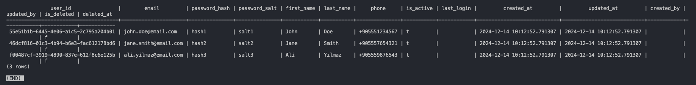
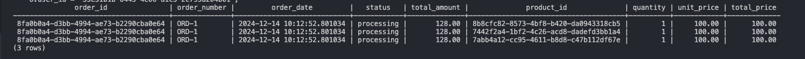
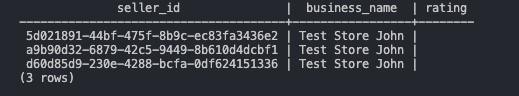
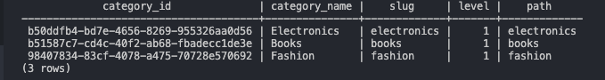
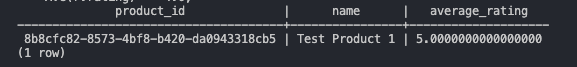
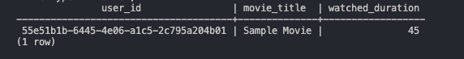
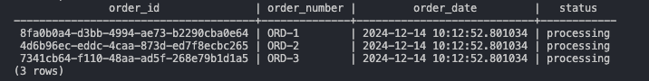
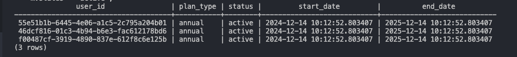
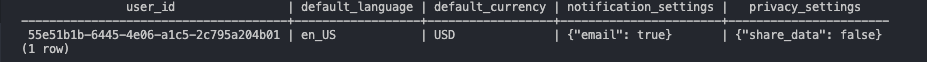

# Amazon Database Query Examples

```sql
SELECT * FROM users.users LIMIT 5;
```


```sql
-- 1. Retrieve a list of active products with their categories and brands
SELECT
    p.product_id,
    p.name AS product_name,
    c.name AS category_name,
    b.name AS brand_name
FROM
    products.products p
JOIN
    products.categories c ON p.category_id = c.category_id
JOIN
    products.brands b ON p.brand_id = b.brand_id
WHERE
    p.is_active = TRUE;
```


```sql
-- 2. Get order details including items and total amount for a specific user
SELECT
    o.order_id,
    o.order_number,
    o.order_date,
    o.status,
    o.total_amount,
    oi.product_id,
    oi.quantity,
    oi.unit_price,
    oi.total_price
FROM
    orders.orders o
JOIN
    orders.order_items oi ON o.order_id = oi.order_id
WHERE
    o.user_id = '55e51b1b-6445-4e06-a1c5-2c795a204b01';
```



```sql
-- 3. List all active sellers with their ratings
SELECT
    s.seller_id,
    s.business_name,
    s.rating
FROM
    marketplace.sellers s
WHERE
    s.status = 'active';
```



```sql
SELECT
    category_id,
    name AS category_name,
    slug,
    level,
    path
FROM
    products.categories;
```


```sql
-- 4. Find all products in a specific category with a minimum rating
SELECT
    p.product_id,
    p.name,
    AVG(r.rating) AS average_rating
FROM
    products.products p
JOIN
    products.reviews r ON p.product_id = r.product_id
WHERE
    p.category_id = 'b50ddfb4-bd7e-4656-8269-955326aa0d56'
GROUP BY
    p.product_id, p.name
HAVING
    AVG(r.rating) >= 4.0;
```



```sql
-- 5. Retrieve user watch history for movies
SELECT
    wh.user_id,
    c.title AS movie_title,
    wh.watched_duration
FROM
    video.watch_history wh
JOIN
    video.content c ON wh.content_id = c.content_id
WHERE
    c.type = 'movie';
```



```sql
-- 6. Get the most recent orders for a user
SELECT
    o.order_id,
    o.order_number,
    o.order_date,
    o.status
FROM
    orders.orders o
WHERE
    o.user_id = '55e51b1b-6445-4e06-a1c5-2c795a204b01'
ORDER BY
    o.order_date DESC
LIMIT 5;
```



```sql
-- 7. List all active promotions and their applicable products
SELECT
    c.name AS campaign_name,
    p.name AS product_name
FROM
    promotions.campaigns c
JOIN
    promotions.campaign_products cp ON c.campaign_id = cp.campaign_id
JOIN
    products.products p ON cp.product_id = p.product_id
WHERE
    c.start_date <= CURRENT_TIMESTAMP AND c.end_date >= CURRENT_TIMESTAMP;
```


```sql
-- 8. Check inventory levels for a specific product variant
SELECT
    i.product_id,
    i.variant_id,
    i.quantity,
    i.reserved_quantity
FROM
    products.inventory i
WHERE
    i.product_id = '55e51b1b-6445-4e06-a1c5-2c795a204b01' AND i.variant_id = '55e51b1b-6445-4e06-a1c5-2c795a204b01';
```

# TODO fill this



```sql
-- 9. Retrieve all active prime memberships
SELECT
    m.user_id,
    m.plan_type,
    m.status,
    m.start_date,
    m.end_date
FROM
    prime.memberships m
WHERE
    m.status = 'active';
```


```sql
-- 10. Get user preferences and settings
SELECT
    u.user_id,
    u.default_language,
    u.default_currency,
    u.notification_settings,
    u.privacy_settings
FROM
    users.preferences u
WHERE
    u.user_id = '55e51b1b-6445-4e06-a1c5-2c795a204b01';
```

